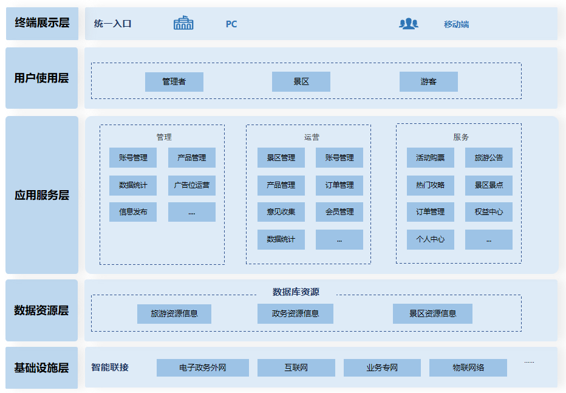

# 智慧文旅系统

#### 一、产品概述

"自定义文旅"是一家专业的智慧文旅平台，致力于为为旅游行业提供全面、智能的解决方案，旨在提升旅游体验、优化资源配置、促进旅游产业的可持续发展。产品的主要目标包括满足游客的个性化需求，提供便捷、高效的服务；帮助旅游企业提高管理效率，降低成本；同时，推动旅游行业的数字化转型和创新发展。

#### 二、软件架构
本软件采用的是uniapp+JAVA语言开发，整个的架构设计完全基于ruoyi-vue项目的标准制作，对其100%兼容，其他模块完全可以平滑移植过来，编码规范完全按照阿里巴巴编码规范；
移动端：采用 uni-app 方案，一份代码多终端适配，同时支持 APP、小程序、H5！；
后端：后端采用 Spring Boot 多模块架构、MySQL + MyBatis Plus、Redis + Redisson Vue3 提供 element-plus、vben(ant-design-vue) 两个版本，Vue2 提供 element-ui 版本。

#### 三、可定制
100%交付，程序员可以根据自己或客户的需求来自定义和扩展平台，以满足不同的业务模型。目前智慧文旅系统支持在线购票、多票联合、旅游推荐等功能。

#### 四、扩展性

源代码扩展性强，可轻松地添加新功能、整合第三方工具或适应不同市场需求。

#### 五、支持和文档

后续会提供开发者文档、技术支持和更新，以帮助程序员更好地理解和使用源代码。

#### 六、服务支持

我们可接受定制，也可帮助程序员建立自己的智慧文旅平台、合作伙伴关系或提供定制解决方案。

| 服务项       | 服务内容                                           | 服务收费 | 服务方式                        |
| ------------ | -------------------------------------------------- | -------- | ------------------------------- |
| 基础问题答疑 | 问题答疑                                           | 免费     | 技术交流群支持-后续开通         |
| 系统部署     | 系统部署                                           | 免费     | 文档自助-[源码部署][Docker部署] |
| 产品使用     | 教学产品各功能使用                                 | 免费     | 文档自助                        |
| 系统部署     | 在客户指定的网络和硬件环境中完成服务部署           | 面议     | 线上部署支持                    |
| 技术支持     | 提供各类部署、功能使用中遇到的问题答疑             | 100元    | 半小时内 线上远程支持           |
| 其他服务     | 企业版源码购买；定制化开发；定制化时长、功能服务等 | 面议     | 面议                            |

付费服务支持或商务合作请联系
<table>
    <tr>
        <td width="350px"></td>
</table>

#### 七、部分设计图
<table>
    <tr>
        <td width="350px"></td>
        <td width="350px"></td>
    </tr>
    <tr>
        <td></td>
        <td></td>
    </tr>
</table>

#### 八、版本更新

1.0版本会逐步添加功能，版本也会逐步迭代。

#### 九、目前功能
在智慧文旅游客端包含多个功能模块，如地图推荐、在线购票、三票联合、旅游推荐等。每个模块都具备独特的特色，如三票联合游客只需通过一张卡，即可轻松访问多个景区，让游客更加便捷地游览景区；投诉建议收集用户的投诉和建议，助力景区不断优化服务质量和游客体验；热门攻略提供丰富的旅游攻略，满足游客的多样化需求。
	
在智慧文旅平台管理端，我们不仅能够全面管理景区景点，还具备发布旅游公告的功能，确保游客能够第一时间获取最新的信息通知。此外，平台还协助政府建立了旅游投诉与建议机制，以便相关部门在收到问题后能够迅速响应，有效解决游客在旅行中遇到的困难。我们致力于通过智慧化的管理手段，不断提升旅游服务的质量和效率。我们致力于通过智慧化的管理手段，不断提升旅游服务的质量和效率。

#### 十、体验
体验演示版，请联系客服微信（使用微信扫码添加好友，请注明“自定义智慧文旅”）。 如需购买商业版源码 请联系客服。

<table>
    <tr>
        <td width="350px"></td>
</table>

